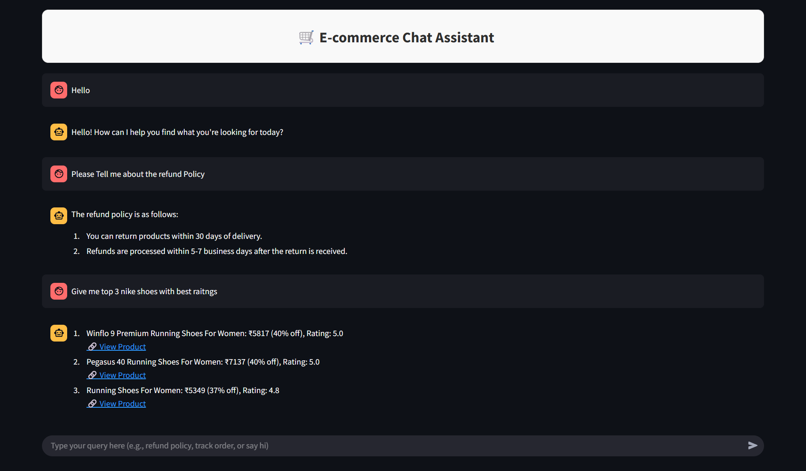

# 🛒 E-commerce Chat Assistant

A smart, conversational AI chat assistant built using Streamlit that enhances user experience on e-commerce platforms by handling both customer queries and product discovery. Powered by Retrieval-Augmented Generation (RAG) using LLaMA3 (via GROQ) and local database integration, this assistant helps users with instant and intelligent responses.

---

## 🌐 Live Website
You can try the tool live here: **[E-commerce Chat Assistant](https://vaibhav-project-e-commerce-chat-assistant.streamlit.app/)**

---

## 🎥 Presentation
Watch the full project presentation here: **[E-commerce Chat Assistant](https://vaibhav-project.my.canva.site/e-commerce-chat-assistant-presentation)**

---

## 📌 Dataset Information
The product data currently includes only women’s footwear. Each product contains attributes like brand, title, price, discount, rating, and total number of reviews.

---

## 🛠 Features  
- Clean and responsive Streamlit-based web interface  
- Supports multiple query types:  
  - **FAQ Queries** using RAG for platform-related questions  
  - **SQL Queries** for dynamic product search and filtering  
  - **Small Talk** support for casual, friendly interaction  
- Uses **Semantic Routing** to identify user intent intelligently  
- Fast and accurate responses powered by **LLaMA-3.3 via GROQ API**  
- Dynamic product listing from a local SQLite database (no backend server required) 
- Modular and well-structured codebase for quick customization and scaling   

---

## 📂 Project Structure

```
E_commerce_Chat_Assistant/
│
├── app/                                # Main application logic
│   ├── main.py                         # Streamlit app entry point
│   ├── faq.py                          # FAQ handling (RAG using ChromaDB)
│   ├── sql.py                          # SQL-based product search
│   ├── smalltalk.py                    # Small talk response logic
│   ├── router.py                       # Semantic intent router
│   ├── db.sqlite                       # SQLite database file
│   └── resources/                      # Data files for ingestion
│       ├── faq_data.csv                # Frequently asked questions dataset
│       └── ecommerce_data_final.csv    # E-commerce product listing data
│
├── web-scraping/                       # E-commerce product scrapers and tools
│   ├── csv_to_sqlite.py                # Convert scraped CSV data to SQLite
│   └── flipkart_data_extraction.ipynb  # Flipkart scraping notebook
│
├── LICENSE                             # Apache License file
├── README.md                           # This documentation
└── requirements.txt                    # Python dependencies
```

---

## 🚀 How to Run Locally  

### ⚠️ Note for Windows Users

This project uses **ChromaDB**, which requires **SQLite ≥ 3.35.0**. Most Linux environments (like Streamlit Cloud) are patched using `pysqlite3-binary`, but:

- **`pysqlite3-binary` does NOT install on Windows**.
- If you're on Windows and the app works, your system SQLite is likely already up-to-date.
- If you encounter a `sqlite3` version error, please [manually install SQLite ≥ 3.35.0](https://www.sqlite.org/download.html) and ensure it's on your system PATH.

> **Do not install `pysqlite3-binary` on Windows** — it's only meant for Linux deployments (e.g., Streamlit Cloud).

### Prerequisites:  
- Python 3.8+

1. **Clone the repository**:
   ```bash
   git clone https://github.com/vaibhavgarg2004/E-commerce-Chat-Assistant.git
   cd E-commerce-Chat-Assistant
   ```
2. **Install dependencies**:   
   ```commandline
    pip install -r requirements.txt
   ```
3. **Add GROQ credentials in a .env file inside the app/ directory**:
    ```text
    GROQ_API_KEY=GROQ_API_KEY_HERE
    GROQ_MODEL=llama-3.3-70b-versatile
   ```
4. **Run the Streamlit app**:   
   ```commandline
    streamlit run app/main.py
   ```

---

## 🧠 How It Works

1. **Intent Classification (using Semantic Router)**  
   - Each user message is analyzed using the **Semantic Router**.  
   - The router classifies the query into one of three categories:  
     - `faq`: platform policies and general info  
     - `sql`: product-related queries using structured data  
     - `smalltalk`: casual or generic conversations  

2. **Routing Logic**  
   - **FAQ Route**: Uses **ChromaDB + Sentence Transformers** to retrieve relevant policy answers via semantic search (RAG).  
   - **SQL Route**: Converts the query into SQL using LLMs and executes it on a **local SQLite product database**.  
   - **Small Talk**: Returns natural, friendly responses to casual inputs, enhancing engagement.  

3. **Dynamic Streamlit Output**  
   - **SQL Route**: Displays filtered product results with links, titles, and prices.  
   - **FAQ Route**: Shows concise and accurate answers sourced from uploaded CSV data.  
   - **Small Talk**: Outputs informal, chatbot-style replies for improved UX.

---
   
## 🖼️ Application Snapshot



---

## 📄 License
This project is licensed under the **Apache License 2.0**. See the [LICENSE](./LICENSE) file for details.

---

*Your AI shopping assistant—ready to serve, search, and support.*

